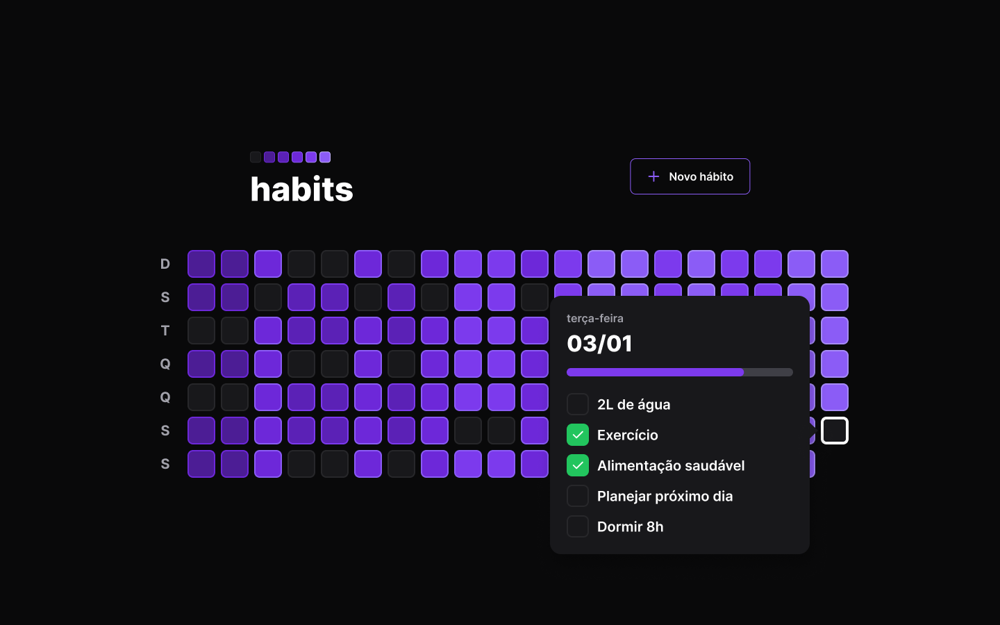

# Habit tracker 

Desenvolvido durante o evento NLW Setup da Rocketseat  
> Para ver o projeto rodando você pode acessar este [Link](link.com.br).

---

Aplicação WEB:

  
  

---
## Funcionalidades

- [x] Modal de criação de hábito
- [x] Popover de detalhes dos hábitos de cada dia
- [x] Progress bar no quadrado de hábito
- [x] Consumo de API com axios

---

## Tecnologias

- [`React`](https://pt-br.reactjs.org/)
- [`Tailwind`](https://nestjs.com/)
- [`Node`](https://tailwindcss.com/)
- [`Fastify`](https://www.fastify.io/)
- [`Prisma`](https://www.prisma.io/)
- [`axios`](https://axios-http.com/ptbr/docs/intro)